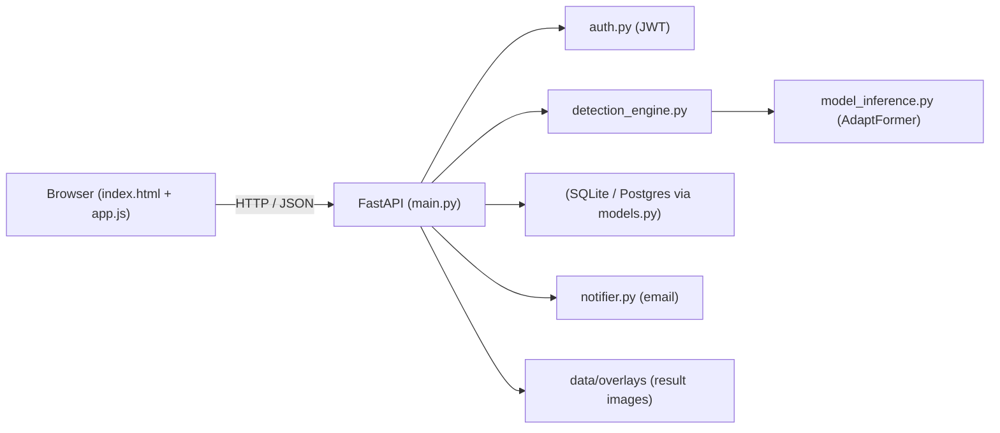
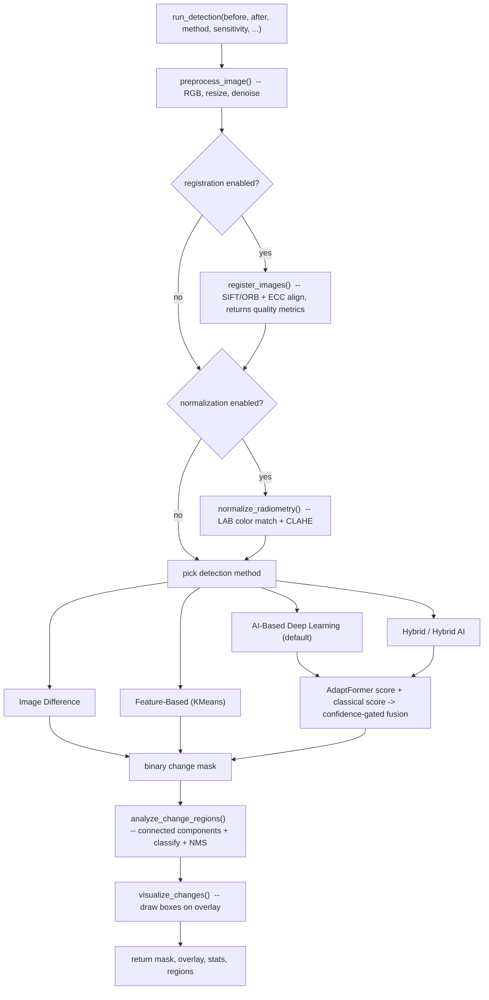
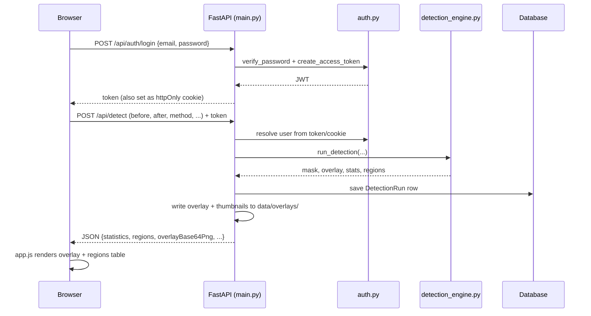

# Satellite Change Detection — Project Workflow Guide

A complete walkthrough of how this project is structured, how a detection request
flows through the system, and how to run it locally. Read this top-to-bottom to get
familiar with the codebase.

---

## 1. What this project does

This is a **standalone web application for satellite image change detection**. A user
uploads two images of the same place taken at different times (a **"before"** and an
**"after"**), and the app:

1. Aligns the two images (registration).
2. Normalizes their colors/brightness.
3. Runs change detection (classical computer vision + a pretrained deep-learning model).
4. Finds and classifies the changed regions (new buildings, vegetation change, water, etc.).
5. Draws the changes on an overlay image and shows statistics.
6. Saves the run to a per-user history (with login/accounts).

It is deployed as a Docker container on **Hugging Face Spaces**, but runs the same way locally.

---

## 2. Tech stack

| Layer | Technology |
|-------|-----------|
| Backend API | **FastAPI** (Python), served by **uvicorn** |
| Image processing | **OpenCV**, **NumPy**, **scikit-learn** |
| Deep learning | **PyTorch** + **Hugging Face Transformers** (AdaptFormer model) |
| Database | **SQLAlchemy** ORM over **SQLite** (default) or **PostgreSQL** |
| Auth | **JWT** tokens (python-jose) + **bcrypt** password hashing (passlib) |
| Frontend | Plain **HTML + CSS + vanilla JavaScript** (single-page app) |
| Email | HTTP email API or SMTP (optional notifications) |
| Deployment | **Docker** → Hugging Face Spaces |

There is **no build step** for the frontend — it's static files served directly.

---

## 3. Repository structure

```
change_detection_webapp/
├── app/
│   ├── main.py             # FastAPI app + all HTTP routes (entry point)
│   ├── detection_engine.py # CORE: preprocessing, registration, detection, classification
│   ├── model_inference.py  # AdaptFormer deep-learning model loader + tiled inference
│   ├── cd_models/          # Extra DL building blocks
│   │   ├── change_model.py  #   Siamese U-Net architecture (optional, needs weights)
│   │   └── model_utils.py   #   tiling, multi-scale, confidence-map helpers
│   ├── auth.py             # JWT create/verify, password hashing, current-user lookup
│   ├── database.py         # SQLAlchemy engine/session, DATA_DIR resolution
│   ├── models.py           # ORM models: User, DetectionRun
│   └── notifier.py         # Email notification sending
├── static/
│   ├── css/style.css       # All styles
│   └── js/app.js           # All frontend logic (auth, upload, render results)
├── templates/
│   └── index.html          # Single-page UI shell
├── scripts/
│   └── validate_detection.py  # Sanity checks for the detection pipeline
├── data/                   # Created at runtime: SQLite DB + overlay/thumbnail images
├── requirements.txt        # Python dependencies
├── Dockerfile              # Container build (also pre-downloads the model)
├── README.md               # Short setup notes (Hugging Face front-matter on top)
└── WORKFLOW.md             # This document
```

> Note: the `app/cd_models/` folder is named `cd_models` (not `models`) on purpose —
> `app/models.py` already exists for the database models, and a folder named `models`
> would shadow it and break imports.

---

## 4. High-level architecture



- The **browser** talks only to FastAPI over JSON + multipart form uploads.
- **main.py** is the only place that defines routes; it delegates the heavy lifting to
  `detection_engine.run_detection(...)`.
- Results (overlay PNGs, thumbnails) are written to `data/overlays/` and referenced by URL.
- Run metadata is stored in the database.

---

## 5. The detection pipeline (the core workflow)

This is the most important part to understand. Everything happens inside
`run_detection()` in [`app/detection_engine.py`](app/detection_engine.py).



### Step by step

1. **Preprocess** (`preprocess_image`): convert to RGB, cap the size (default 1600px max
   side) for speed, apply light Gaussian blur (and a bilateral filter only when the image
   is noisy) to reduce sensor noise without destroying edges.

2. **Register / align** (`register_images`): the two screenshots rarely line up perfectly.
   - First tries **SIFT + FLANN** feature matching → homography.
   - Falls back to **ORB** features if SIFT is weak.
   - Refines with **ECC** (sub-pixel alignment).
   - Falls back to **multi-scale ECC** if feature matching fails entirely.
   - Returns an `(img1, img2_aligned, registration_ok, reg_meta)` tuple. `registration_ok`
     and the quality metrics (inlier ratio, NCC) are surfaced to the UI as an
     **alignment warning** when the alignment is weak — important for Google Earth
     screenshots that differ in zoom/crop.

3. **Radiometric normalization** (`normalize_radiometry`): match the "after" image's color
   statistics to the "before" image in LAB space, plus symmetric CLAHE on the lightness
   channel, so lighting/season differences don't look like real change.

4. **Detection method** (selected by the `method` argument):
   - **AI-Based Deep Learning** (default): runs the **AdaptFormer** model
     (`model_inference.predict_change_mask`) to get a per-pixel change probability map,
     computes a **classical** multi-channel score map (color ΔE, SSIM, texture/LBP, edges,
     change-vector analysis), then **fuses** them with `fuse_dl_and_classical()`. Fusion is
     **confidence-gated** (not a blind union): the model drives structural changes, the
     classical signal + Excess-Green index supports vegetation changes.
   - **Image Difference**: LAB ΔE difference with adaptive (Otsu/MAD) thresholding.
   - **Feature-Based**: KMeans clustering of per-pixel difference features.
   - **Hybrid / Hybrid AI**: weighted combinations of the above.

5. **Clean the mask** (`_clean_mask`): morphological open/close, hole filling, remove tiny
   or thin (shadow-like) components.

6. **Find & classify regions** (`analyze_change_regions`): connected-components on the mask
   → bounding boxes → `classify_object_type()` assigns a label (New Construction/Building,
   Vegetation Change, Water Body Change, Road/Pavement, Bare Land, etc.) with a confidence
   and severity → **non-maximum suppression** removes overlapping/duplicate boxes.

7. **Visualize** (`visualize_changes`): draw a subtle tint on changed pixels and numbered,
   color-coded boxes for the top regions.

8. **Return** `change_mask, result_image, stats, change_regions` back to `main.py`.

### Sensitivity

The `detection_sensitivity` slider (0–1, default 0.5) shifts thresholds: higher = detect
more (more recall, more false positives), lower = stricter (fewer, higher-confidence
detections).

---

## 6. The deep-learning model

- File: [`app/model_inference.py`](app/model_inference.py)
- Model: **`deepang/adaptformer-LEVIR-CD`** (a change-detection transformer trained on the
  LEVIR-CD building dataset), pulled from the Hugging Face Hub.
- It is **pre-downloaded at Docker build time** (see the Dockerfile) so cold starts are fast,
  and **preloaded on app startup** so the first request isn't slow.
- Inference is **tile-based**: the image is split into overlapping 256×256 tiles (the model's
  native size), each tile is predicted, and the results are stitched back with a
  raised-cosine blend to avoid visible seams.
- If PyTorch/Transformers aren't installed or the model fails to load, the engine **falls
  back gracefully** to the classical-only path — the app still works.

`app/cd_models/change_model.py` contains a from-scratch **Siamese U-Net** as an alternative
DL backbone. It only activates if a trained weights file exists at
`app/cd_models/weights/siamese_unet_cd.pt` (none is shipped), so it's currently dormant.

---

## 7. Request lifecycle (auth + detect)



---

## 8. Data model

Defined in [`app/models.py`](app/models.py):

- **User**: `id, email (unique), hashed_password, full_name, created_at`
- **DetectionRun**: `id, user_id, title, method, total_pixels, changed_pixels,
  change_percentage, regions_count, overlay_path, before/after thumbnail paths, zone,
  village, regions_json (serialized regions), created_at`

The database file lives at `data/satellite_app.db` (SQLite) and is created automatically on
first run. Set `DATABASE_URL` to use PostgreSQL instead.

---

## 9. API reference

All routes are in [`app/main.py`](app/main.py).

| Method & path | Purpose |
|---------------|---------|
| `POST /api/auth/register` | Create account `{email, password, full_name}` → token |
| `POST /api/auth/login` | Log in `{email, password}` → token (+ cookie) |
| `POST /api/auth/logout` | Clear auth cookie |
| `POST /api/auth/reset-password` | Set a new password `{email, new_password}` |
| `GET /api/me` | Current user (requires auth) |
| `POST /api/detect` | **Main endpoint.** multipart: `before`, `after` files + `method`, `title`, `zone`, `village`, `enable_registration`, `enable_normalization`, `detection_sensitivity`, `min_region_area`, `notify_email` |
| `GET /api/history` | List the current user's past runs |
| `POST /api/notify/test` | Send a test email |
| `GET /api/overlay/<path>` | Serve a saved overlay / thumbnail image |
| `GET /health` | Lightweight health check (no DB) |
| `GET /` | Serves the single-page UI |

`POST /api/detect` returns: `statistics` (pixels, change %, threshold debug, alignment
warning), `regions` (list with type/confidence/severity/bbox), and the overlay as base64 PNG.

---

## 10. Frontend

- [`templates/index.html`](templates/index.html) is the shell: login/register forms, the
  upload form, history table, and the result modal.
- [`static/js/app.js`](static/js/app.js) handles everything client-side: calling the API,
  storing the token, submitting the detect form, and rendering results (the before/after
  slider, the regions table, alignment warnings, and fusion stats).
- [`static/css/style.css`](static/css/style.css) holds all styling.
- Cache-busting: the `?v=NN` suffixes on the CSS/JS `<link>`/`<script>` tags are bumped when
  those files change so browsers don't serve stale copies.

---

## 11. Running locally

### Option A — Python virtual environment (recommended for development)

```bash
cd change_detection_webapp

# 1. Create and activate a virtual environment
python -m venv venv
# Windows (PowerShell):
venv\Scripts\Activate.ps1
# macOS / Linux:
source venv/bin/activate

# 2. Install dependencies (this pulls CPU PyTorch + Transformers, ~couple GB)
pip install -r requirements.txt

# 3. Run the dev server (auto-reload on code changes)
uvicorn app.main:app --reload --host 0.0.0.0 --port 8000
```

Open **http://localhost:8000**, register an account, then upload a before/after pair.

> First detection run downloads the AdaptFormer model from Hugging Face (one time).
> If you don't have PyTorch installed or want a lighter setup, the app still runs using
> the classical detection path only.

### Option B — Docker (mirrors production)

```bash
cd change_detection_webapp
docker build -t change-detection .
docker run -p 7860:7860 change-detection
```

Open **http://localhost:7860**. The Docker build pre-downloads the model, so the first
request is fast.

### Validate the pipeline

```bash
python scripts/validate_detection.py
```

This runs registration/fusion/end-to-end sanity checks on synthetic images.

---

## 12. Configuration (environment variables)

| Variable | Default | Purpose |
|----------|---------|---------|
| `DATABASE_URL` | `sqlite:///data/satellite_app.db` | Use PostgreSQL by setting this |
| `SECRET_KEY` | (in `auth.py`) | JWT signing key — **set this in production** |
| `HF_HOME` | `/app/.hf_cache` (Docker) | Where the model is cached |
| `EMAIL_API_URL` | manager's API | Email backend; empty + `SMTP_USER`/`SMTP_PASS` for SMTP |
| `PORT` | `7860` | Port uvicorn binds to in the container |
| `SPACE_ID` | (set by HF) | When present, data is written to `~/data` |

---

## 13. Deployment (Hugging Face Spaces)

- The Space is a **Docker** Space. Pushing to its git remote triggers a rebuild.
- Hugging Face builds from the **`main`** branch. (This repo's working branch is `master`,
  so deploys push `master` → both `master` and `main` on the HF remote.)
- The `ARG APP_BUILD=NN` line in the Dockerfile is a cache-buster: bumping it forces pip to
  reinstall and the model to re-download on the next build.
- The YAML front-matter at the top of `README.md` (title, emoji, `sdk: docker`,
  `app_port: 7860`) is what Hugging Face reads to configure the Space.

---

## 14. Common tasks & gotchas

- **"It's detecting too much / too little"** → adjust the sensitivity slider, and make sure
  the before/after images are the **same location, zoom, and crop**. Weak alignment shows an
  alignment warning in the result panel.
- **Changed CSS/JS but nothing updates** → bump the `?v=NN` query string in `index.html`.
- **Adding a DB column** → update `app/models.py`; the app creates tables on startup
  (there's lightweight migration handling in `main.py`).
- **Don't create a folder named `app/models/`** → it shadows `app/models.py`.
- **Model not loading** → the app logs a warning and continues with classical detection;
  check the logs for the AdaptFormer load message.

---

## 15. Where to start reading the code

1. [`app/main.py`](app/main.py) — see the routes, especially `POST /api/detect`.
2. [`app/detection_engine.py`](app/detection_engine.py) — start at `run_detection()` at the
   bottom and follow the calls upward.
3. [`app/model_inference.py`](app/model_inference.py) — how the DL model is loaded and run.
4. [`static/js/app.js`](static/js/app.js) — how the frontend calls the API and renders results.

Welcome to the project!
