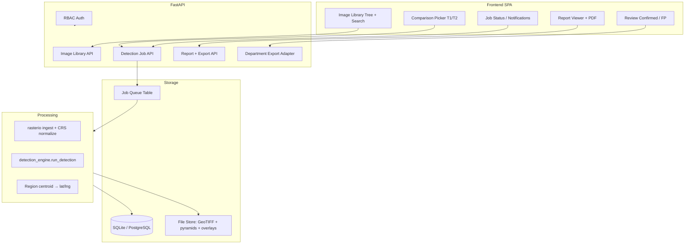

# DDA Change Detection — Implementation Plan (Dev Space Only)

**Document:** Scope of Work → Engineering Plan  
**Client:** DDA (Delhi Development Authority)  
**Target environment:** Hugging Face **`satdetect-dev`** only (`hf-dev` remote, `master` branch)  
**Production (`satdetect`) must not receive these changes until explicit sign-off.**

---

## 1. Executive summary

The SOW transforms the current “upload two PNGs → run detection → view history” demo into a **departmental change-monitoring system** with:

- A **persistent image library** (GeoTIFF, hierarchical metadata, search)
- **Library-driven comparison** (Base T1 vs Comparison T2)
- **Async AI detection** with geo-referenced outputs
- **Reports** (browser + PDF + email)
- **Geo-navigation** and **clickable regions**
- **Human review** (Confirmed / False Positive) and **export to departmental systems**

The existing codebase is a strong **Phase-0 foundation**: AdaptFormer-based detection, region classification, overlay UI, email notifier, and history. Roughly **40% of FR-07** exists; **FR-01–FR-06 and FR-08 are largely net-new**.

**Recommended approach:** Implement behind a **`APP_MODE=dda`** feature flag on dev, extend the database and API vertically, and keep production on the current simplified flow indefinitely.

---

## 2. SOW requirements → current state

| ID | Requirement | Current state | Gap severity |
|----|-------------|---------------|--------------|
| **FR-01** | Centralized image library (Zone → Village → Area → Year or Grid) | Zone/Village are free-text dropdowns on upload; images discarded after run except thumbnails | **Large** |
| **FR-02** | GeoTIFF upload + validation + manual georef fallback | PNG/JPEG only, 20 MB, Pillow RGB load | **Large** |
| **FR-03** | Pick Base/Comparison from library or drag from tree | Local file upload only | **Medium** (depends on FR-01) |
| **FR-04** | AI detection as background job; simplified change types; lat/lng per region | Synchronous `/api/detect`; rich internal taxonomy; pixel coords only | **Medium–Large** |
| **FR-05** | In-app notification + report link; PDF export; persistent reports | Email optional; HTML modal report; no PDF; history exists | **Medium** |
| **FR-06** | Navigate to change by lat/lng; Locate action | No geospatial metadata | **Large** (depends on FR-02) |
| **FR-07** | Clickable regions auto-pan viewer; side-by-side Base/Comparison | Region row hover + compare slider partially exist | **Small–Medium** |
| **FR-08** | Confirm / False Positive; submit to dept API or export | Not implemented | **Medium** |

### SOW change-type mapping (canonical output)

Map internal `detection_engine` labels → DDA report types:

| DDA type | Internal sources (examples) |
|----------|------------------------------|
| **New Construction** | New Construction/Building, Temporary Structure, Road/Pavement Change (New) |
| **Demolition** | Demolition/Clearing, Partial/Full Demolition |
| **Extension** | Expansion, Widening, Renovation |
| **Vegetation Change** | Vegetation Change (+ sub-types) |
| **Other** | Water Body, Bare Land/Soil, Unclassified |

Store both `dda_change_type` (report) and `internal_object_type` (model/debug) on each region.

---

## 3. Deployment & branching strategy

```
master (DDA features)  ──push──►  hf-dev  →  coderuday21/satdetect-dev
production             ──push──►  hf       →  coderuday21/satdetect  (frozen)
```

### Dev-only safeguards

1. **`APP_MODE` env var** on `satdetect-dev`: `dda` enables library, GeoTIFF, jobs, RBAC, review UI. Default / production: `legacy`.
2. **Separate DB file** on dev: `data/dda_app.db` (avoid mixing guest history with library assets).
3. **All new routes** under `/api/dda/*` or gated by `APP_MODE` in `main.py`.
4. **CI checklist** before any production promote: diff must not touch DDA modules unless mode flag documented.

---

## 4. Target architecture



---

## 5. Data model (new & extended)

### 5.1 Hierarchy (FR-01)

Two organization modes (user selects at library root):

**A. Administrative (default for DDA Delhi)**  
`Zone` → `Village` → `Area` → `Year` → `[ImageAsset…]`

**B. Grid**  
`GridId` (e.g. `G-12-04`) → `Year` → `[ImageAsset…]`

Implement as normalized tables (not hardcoded JS):

```text
zones(id, name, mode)           -- mode: admin | grid_parent
villages(id, zone_id, name)     -- nullable for grid mode
areas(id, village_id, name)
library_years(id, area_id, year) -- optional grouping node; images also store year directly
```

For MVP, **Area** can be a free-text field on `ImageAsset` if DDA taxonomy is not finalized.

### 5.2 `ImageAsset` (FR-01, FR-02)

| Column | Purpose |
|--------|---------|
| `id`, `uuid` | Primary identifiers |
| `zone_id`, `village_id`, `area_name`, `year`, `grid_id` | Hierarchy |
| `capture_date` | Required metadata |
| `source` | `satellite` \| `drone` |
| `format` | `geotiff` |
| `file_path`, `thumb_path`, `preview_path` | Storage |
| `crs`, `bounds_json` | Geo metadata (WGS84 bbox) |
| `width`, `height`, `file_size_bytes` | Validation |
| `has_georef` | bool |
| `manual_location_json` | Fallback corner coords + notes if no embedded georef |
| `uploaded_by`, `created_at` | Audit |

### 5.3 `DetectionJob` (FR-04 async)

| Column | Purpose |
|--------|---------|
| `id`, `status` | `queued` \| `running` \| `completed` \| `failed` |
| `base_image_id`, `comparison_image_id` | FK → ImageAsset |
| `method`, `params_json` | Detection settings |
| `run_id` | FK → DetectionRun when done |
| `error_message`, `started_at`, `completed_at` | Job lifecycle |
| `notify_email`, `notify_in_app` | FR-05 |

### 5.4 Extend `DetectionRun`

Add: `base_image_id`, `comparison_image_id`, `job_id`, `report_pdf_path`, `status` (`draft` \| `published`).

### 5.5 Extend region JSON schema

Each region gains:

```json
{
  "ddaChangeType": "New Construction",
  "confidence": 0.87,
  "areaSqM": 142.5,
  "centroid": { "x": 412, "y": 288 },
  "latLng": { "lat": 28.6139, "lng": 77.2090 },
  "bbox": { "x": 380, "y": 260, "w": 64, "h": 56 },
  "reviewStatus": "pending",
  "reviewedBy": null,
  "reviewedAt": null
}
```

### 5.6 `RegionReview` + export batch (FR-08)

```text
region_reviews(id, run_id, region_id, status, reviewer_id, notes, submitted_at)
export_batches(id, run_id, format, payload_path, dept_api_response, created_at)
```

### 5.7 RBAC (FR-01, FR-02)

Extend `User`:

```text
role: viewer | uploader | analyst | admin
```

| Role | View library | Upload | Run detection | Review/submit |
|------|--------------|--------|---------------|---------------|
| viewer | ✓ | | | |
| uploader | ✓ | ✓ | | |
| analyst | ✓ | ✓ | ✓ | ✓ |
| admin | ✓ | ✓ | ✓ | ✓ + manage hierarchy |

**Dev Space:** Re-enable login UI when `APP_MODE=dda`. Production stays guest/no-login.

---

## 6. API design (dev / DDA mode)

### 6.1 Image library

| Method | Path | Description |
|--------|------|-------------|
| `GET` | `/api/dda/hierarchy` | Tree: zones → villages → areas → years (+ counts) |
| `GET` | `/api/dda/images` | Filter: `zone`, `village`, `area`, `year`, `date_from`, `date_to`, `grid_id`, `q` |
| `POST` | `/api/dda/images/upload` | Multipart GeoTIFF + metadata form |
| `GET` | `/api/dda/images/{id}` | Metadata + thumb URL |
| `GET` | `/api/dda/images/{id}/preview` | Downsampled PNG/Web tile for viewer |
| `DELETE` | `/api/dda/images/{id}` | Admin only |

**Upload validation (FR-02):**

1. Extension `.tif` / `.tiff`
2. Max size: **500 MB dev** (configurable; DDA responsible for suitable resolution per SOW)
3. `rasterio.open()` — verify readable, extract CRS/transform
4. If no georef: require `manual_bounds` (SW/NE lat-lng) + `capture_date` before commit
5. Generate 512px thumbnail + 2048px preview for UI
6. Return `{ id, status: "success" | "failed", errors[] }`

### 6.2 Comparison & detection jobs

| Method | Path | Description |
|--------|------|-------------|
| `POST` | `/api/dda/jobs` | Body: `{ baseImageId, comparisonImageId, method?, notifyEmail? }` → `{ jobId }` |
| `GET` | `/api/dda/jobs/{id}` | Status + progress + runId when complete |
| `GET` | `/api/dda/jobs` | User's recent jobs (in-app notification feed) |
| `POST` | `/api/dda/detect` | **Legacy sync path** for small previews only (keep for HF debugging) |

**Job runner logic:**

```text
POST /jobs → insert DetectionJob(queued)
           → return 202 + jobId
Background worker thread:
  1. Load ImageAsset paths via rasterio
  2. Align pair (same CRS; reproject if needed)
  3. Windowed read → RGB numpy arrays (max 1600px for DL)
  4. run_detection(...)
  5. For each region: pixel centroid → lat/lng via transform
  6. Map object types → ddaChangeType
  7. Save DetectionRun + overlay + update job completed
  8. Fire notification (in-app row + optional email with report link)
```

**HF timeout mitigation:** Job endpoint returns immediately; worker runs in-process with status polling. For GeoTIFFs >60s, use **pyramid preview** for detection (DDA supplies suitable resolution) and store full metadata separately. Document in UI: “Analysis uses optimized resolution; full GeoTIFF retained in library.”

### 6.3 Reports (FR-05)

| Method | Path | Description |
|--------|------|-------------|
| `GET` | `/api/dda/reports/{run_id}` | Full report JSON (existing shape + geo fields) |
| `GET` | `/api/dda/reports/{run_id}/pdf` | Generate/download PDF |
| `POST` | `/api/dda/reports/{run_id}/notify` | Email with link to report |

**PDF engine:** `weasyprint` or `reportlab` — HTML template reuse from `templates/ChangeDetection.html`.

**In-app notification:** Bell icon + `/api/dda/jobs?status=completed&unseen=true`.

### 6.4 Geo-navigation (FR-06, FR-07)

No external map SDK required for MVP — **image viewer geo mode**:

- Report shows `lat, lng` per region
- **Locate** button: pan/zoom canvas to bbox center at 200% zoom, pulse highlight
- Optional Phase 2: Leaflet minimap with footprint rectangle

Frontend already has region hover → bbox highlight; extend to **click row → scroll viewer + zoom**.

Side-by-side: keep existing compare slider; add locked **T1 | T2 | Overlay** tabs when images loaded from library.

### 6.5 Review & departmental export (FR-08)

| Method | Path | Description |
|--------|------|-------------|
| `PATCH` | `/api/dda/reports/{run_id}/regions/{region_id}` | `{ reviewStatus: confirmed \| false_positive, notes? }` |
| `POST` | `/api/dda/reports/{run_id}/submit` | Submit confirmed only |
| `GET` | `/api/dda/reports/{run_id}/export.{csv\|xlsx\|pdf}` | Structured export |

**Department adapter pattern:**

```python
class DepartmentExporter(Protocol):
    def submit(self, run: DetectionRun, regions: list) -> ExportResult: ...

class ApiExporter(DepartmentExporter):      # DEPT_API_URL + DEPT_API_KEY
class FileExporter(DepartmentExporter):     # CSV/XLSX fallback
```

False positives: persist in `region_reviews` with `status=false_positive` for future training export (`/api/dda/training/export` — admin only, Phase 2).

---

## 7. GeoTIFF processing pipeline (accurate logic)

### 7.1 Ingest

```python
def ingest_geotiff(path: Path) -> GeoImageMeta:
    with rasterio.open(path) as src:
        crs = src.crs
        bounds = transform_bounds(src.crs, "EPSG:4326", *src.bounds)
        has_georef = crs is not None and src.transform != rasterio.identity()
        # Prefer RGB or first 3 bands; handle 1-band grayscale
        preview = read_downsampled(src, max_side=2048)
    return meta
```

**Dependencies to add (dev only branch):** `rasterio`, `pyproj` (GDAL wheels on Docker).

### 7.2 Pair compatibility check (before job starts)

| Check | Action |
|-------|--------|
| Same CRS or reproject T2 → T1 CRS | Reproject comparison raster |
| Overlapping bounds | Warn if <50% overlap |
| Band count | Harmonize to RGB |
| Resolution ratio | Warn if >2× GSD difference |

### 7.3 Pixel → lat/lng

```python
def region_centroid_latlng(region_bbox, transform, crs):
    cx = region_bbox.x + region_bbox.w / 2
    cy = region_bbox.y + region_bbox.h / 2
    lng, lat = rasterio.transform.xy(transform, cy, cx, offset="center")
    if crs != EPSG:4326:
        lng, lat = transform_coords(crs, 4326, lng, lat)
    return lat, lng
```

### 7.4 Area in m²

Use pixel area × GSD² from transform (for projected CRS in meters).

---

## 8. Frontend plan (dev UI)

Replace single upload card with **tabbed workflow** when `APP_MODE=dda`:

### Tab 1 — Image Library
- Left: collapsible tree (Zone → Village → Area → Year)
- Right: grid of thumbnails + metadata
- Upload modal: GeoTIFF + form (hierarchy, capture date, source, manual bounds if needed)
- Search bar + filters

### Tab 2 — Change Detection
- Two slots: **Base (T1)** | **Comparison (T2)**
- Drag image from library OR picker dialog
- Show thumb + capture date for each
- Run → job submitted → progress spinner → auto-open report on complete

### Tab 3 — Reports & Review
- List of completed runs
- Open report → regions table with DDA types, lat/lng, confidence, area
- **Locate** per row; click row → pan viewer
- Toggle Confirmed / False Positive
- Submit to department / Download export

### Tab 4 — Notifications
- Job completion feed (FR-05 in-app)

**Auth screens:** Login/register return on dev only (`APP_MODE=dda`).

---

## 9. Implementation phases

### Phase 0 — Foundation (3–4 days)
- [ ] `APP_MODE` flag + route gating in `main.py`
- [ ] Alembic-style migrations or existing startup migrations for new tables
- [ ] `rasterio` in `requirements.txt` + Docker GDAL base image update (dev Dockerfile branch)
- [ ] Seed script: import current `DELHI_ZONES` into DB
- [ ] Dev README section

### Phase 1 — Image library (FR-01, FR-02) (5–7 days)
- [ ] Models: hierarchy + ImageAsset
- [ ] Upload API + validation + thumbnail generation
- [ ] Library tree + search UI
- [ ] RBAC: uploader vs viewer

### Phase 2 — Library-based comparison (FR-03) (2–3 days)
- [ ] T1/T2 picker from library
- [ ] Drag-and-drop from tree to comparison slots
- [ ] Preview + capture date display

### Phase 3 — Async detection + geo output (FR-04, FR-06) (5–6 days)
- [ ] DetectionJob worker + polling API
- [ ] GeoTIFF → RGB pipeline integration with `detection_engine`
- [ ] DDA change type mapping + lat/lng + area m² on regions
- [ ] Job failure handling + user messaging

### Phase 4 — Reports & notifications (FR-05) (3–4 days)
- [ ] In-app notification feed
- [ ] Report page (browser)
- [ ] PDF export
- [ ] Email with report deep link

### Phase 5 — Interactive viewer (FR-07) (2–3 days)
- [ ] Locate button + click-to-pan/zoom
- [ ] Side-by-side T1/T2/overlay modes
- [ ] Region highlight sync (extend existing hover logic)

### Phase 6 — Review & export (FR-08) (4–5 days)
- [ ] Per-region review state
- [ ] CSV/XLSX/PDF export of confirmed changes
- [ ] Department API adapter (config-driven)
- [ ] False-positive archive for training

### Phase 7 — Hardening & UAT (3–5 days)
- [ ] Load test with sample GeoTIFFs from DDA
- [ ] Alignment QA on drone vs satellite pairs
- [ ] Security review (auth, upload limits, path traversal)
- [ ] Deploy checklist for `satdetect-dev`

**Total estimate:** ~25–35 working days (1 senior dev), assuming DDA provides sample GeoTIFFs and hierarchy taxonomy early.

---

## 10. Hugging Face dev constraints & mitigations

| Constraint | Impact | Mitigation |
|------------|--------|------------|
| ~60s HTTP timeout (cpu-basic) | Sync detect fails on large TIFF | Async jobs + immediate 202 response; detection on downsampled preview |
| Ephemeral disk | Library loss on rebuild | HF persistent storage volume; document backup to S3 optional |
| No GPU | Slow DL | Keep AdaptFormer on CPU tiles; cap image size; queue one job at a time |
| 50 GB space limit | Large GeoTIFF library | Per-file quota; admin purge; external blob store Phase 2 |
| Single worker | No true queue | SQLite job lock; one `running` job at a time |

**Dockerfile (dev):** Switch base to `osgeo/gdal:ubuntu-small` or install `libgdal` in existing image.

---

## 11. File / module layout (new code)

```text
app/
├── dda/
│   ├── __init__.py
│   ├── config.py              # APP_MODE, limits, DEPT_API_*
│   ├── models_library.py      # ImageAsset, hierarchy ORMs
│   ├── models_jobs.py         # DetectionJob, RegionReview, ExportBatch
│   ├── geotiff_io.py          # rasterio ingest, reproject, preview
│   ├── geo_regions.py         # pixel→lat/lng, area m²
│   ├── change_type_map.py     # internal → DDA types
│   ├── job_runner.py          # async detection worker
│   ├── library_routes.py      # FR-01, FR-02 API
│   ├── jobs_routes.py         # FR-04 API
│   ├── reports_routes.py      # FR-05, PDF
│   ├── review_routes.py       # FR-08
│   └── dept_export.py         # adapter pattern
├── static/js/dda/
│   ├── library.js
│   ├── comparison.js
│   ├── jobs.js
│   └── review.js
└── templates/
    ├── index.html             # legacy (production)
    └── index_dda.html         # dev SPA shell
```

Wire routers in `main.py`:

```python
if os.getenv("APP_MODE") == "dda":
    app.include_router(library_routes.router, prefix="/api/dda")
    ...
```

Set on **`satdetect-dev`** Space: `APP_MODE=dda`.  
Leave **`satdetect`** unset → legacy behavior.

---

## 12. Testing strategy

| Layer | Tests |
|-------|-------|
| GeoTIFF ingest | Unit: georef / no-georef / 1-band / 4-band samples |
| Pair validation | CRS mismatch, non-overlap |
| Job lifecycle | queued → running → completed/failed |
| lat/lng accuracy | Known corner coords → centroid within tolerance |
| DDA type mapping | Snapshot tests on classified regions |
| RBAC | Role forbidden on upload/delete |
| PDF | Report renders all mandatory fields |
| E2E | Upload 2 TIFFs → job → report → confirm → CSV export |

Use `scripts/validate_detection.py` extended with GeoTIFF fixtures.

---

## 13. Risks & dependencies

| Risk | Owner | Mitigation |
|------|-------|------------|
| DDA GeoTIFF quality / GSD | DDA (per SOW) | Pre-upload validation messages |
| No departmental API spec | DDA IT | File export fallback (FR-08) |
| Area taxonomy not finalized | DDA | Configurable hierarchy admin UI |
| Model accuracy on drone imagery | Shared | Alignment warnings; false-positive review loop |
| HF CPU timeout | Engineering | Async jobs + downsample policy |

**Blocked until DDA provides:**
1. Sample GeoTIFF pairs (georeferenced + one without georef)
2. Zone/Village/Area master list (or confirm Delhi list)
3. Department API spec OR confirm export-only
4. Grid definition if grid mode required at launch

---

## 14. Out of scope (explicit)

- Training/fine-tuning new DL models (use existing AdaptFormer + review feedback archive for Phase 2)
- Full GIS desktop analysis (QGIS replacement)
- Real-time satellite ingestion feeds
- Mobile native apps
- Production deployment of DDA features (until UAT sign-off)

---

## 15. Immediate next steps

1. **Create `satdetect-dev` Space env:** `APP_MODE=dda`
2. **Phase 0 PR** to `master` → `git push hf-dev master:main`
3. **Request from DDA:** 3 sample GeoTIFF pairs + hierarchy spreadsheet
4. **Implement Phase 1** (library + upload) — highest dependency for all other FRs

---

## Appendix A — Legacy endpoint compatibility

Keep existing endpoints working in legacy mode:

| Legacy | DDA equivalent |
|--------|----------------|
| `POST /api/detect` (multipart files) | `POST /api/dda/jobs` (library IDs) |
| `GET /api/history` | `GET /api/dda/reports` |
| Guest user | RBAC users with roles |

No breaking changes to production API contract.

---

## Appendix B — Sample job response

```json
{
  "jobId": 42,
  "status": "completed",
  "runId": 108,
  "reportUrl": "/api/dda/reports/108",
  "summary": {
    "regionsCount": 7,
    "changePercentage": 2.34,
    "byType": {
      "New Construction": 3,
      "Vegetation Change": 2,
      "Other": 2
    }
  }
}
```

---

*Plan version 1.0 — derived from **Scope of Work_Change Detection-For Team.docx** (FR-01 through FR-08).*
